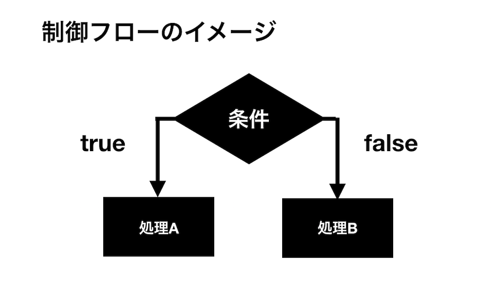
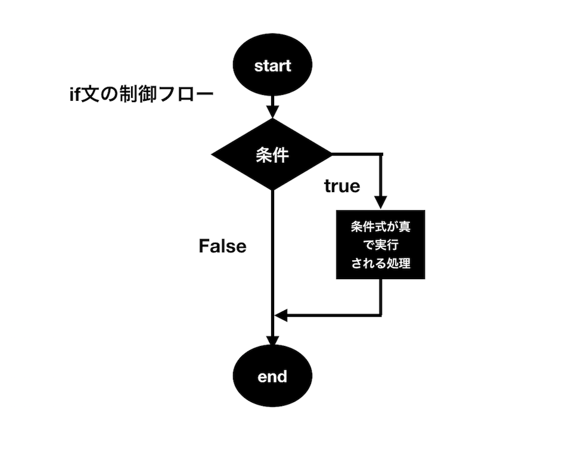
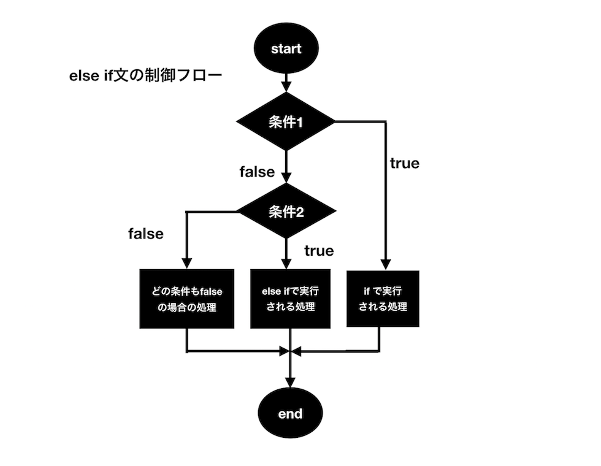
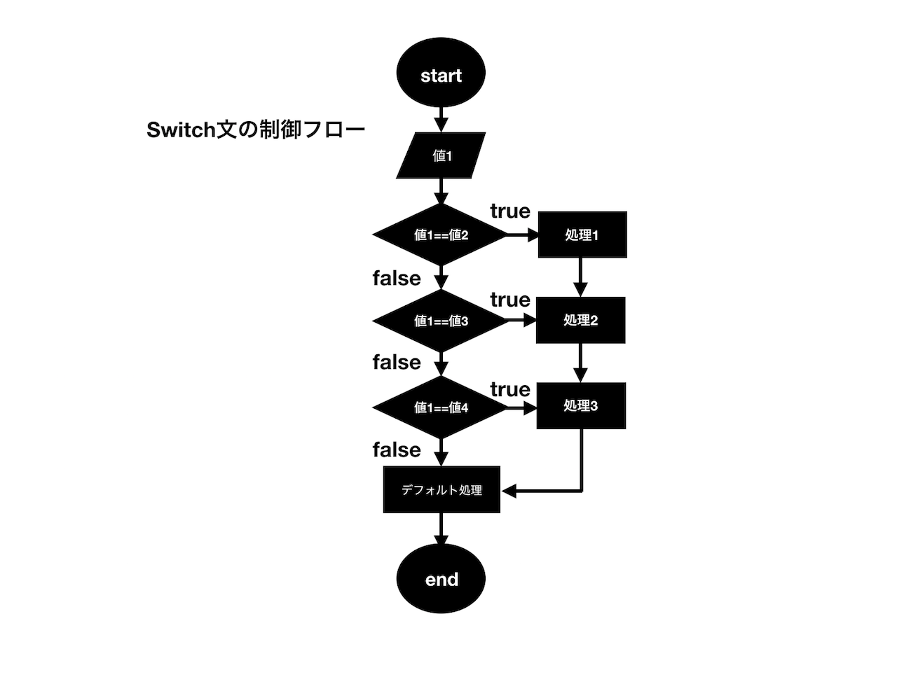

# Lesson 6. ステートメント(文) その1 - if文、switch文

## 目的

- 制御文の概念を理解する。
- if文、switch文を利用してプログラムを書けるようになる。

## 制御文

プログラミングの世界では条件により、その後の処理の内容を変化させていく方法が頻繁に行われます。条件によって処理の内容を分岐させていくことを**条件分岐**と言います。JavaScriptが使われるウェブサイトの場合でも時刻によって表示させる内容を変えたり、ブラウザのバージョンによってURLの値を変更したり、その他にも様々な場面で条件分岐は使われます。

このレッスンで学習する**_if文_**や**_switch文_**といった**_制御文_**と呼ばれる文は、そういった条件分岐処理を制御するのに使われます。制御文を使って処理を分岐させていくことでより複雑なプログラムを組むことができるようになります。

## 制御フロー

プログラミングでは条件分岐を行う際は、**_条件式_**と呼ばれる式を判断します。条件式はその中に記述された条件が真であれば`true`、偽であれば`false`を返します。この`true`か`false`のどちらを返すのかによってその次に続く処理を分岐させます。この条件分岐の構造を示すものを**_制御フロー(control structure)_**と呼びます。



プログラミンングをしていると、時として条件分岐が複数に枝分かれしてそのプロセスの流れが非常に複雑になることがあります。簡単な条件分岐であれば特に問題ないのですが、複雑な条件分岐の場合、その処理のプロセスを明確に把握しておくことはコードを設計する上でとても重要です。


## 条件式

ここでは先ほど述べた**_条件式_**について説明します。まず以前学習した論理型(Boolean)について簡単に確認しておきます。論理型というのは**真**と**偽**の2つの値しか持たない型のことです。JavaScriptでは真の場合を'true'、偽の場合を'false'という値(論理値)で表します。これらはあくまで論理型の値であって文字列ではないことに注意してください。

さて、プログラムが条件分岐を行う際にどうやって判断を行なっているかというと、すでに述べたように**_条件式_**というものを評価して真偽の判断を行います。もし条件式が真であればその式は`true`となり、そうでなければ`false`となります。  

簡単な条件式の例として`2 > 1`という式を考えてみます。「>」はすでに学んだように比較演算子と呼ばれるものです。左右の値の大小を比較し、その計算式が成り立つ場合には`true`、そうでない場合にはfalseを返します。`2 > 1`は常に成り立つのでこの条件式は常に`true`を返します。

以下は制御文の一つである**_if文_**を使った条件分岐の例です。

```js
if(2 > 1){
  console.log(typeof (2 > 1)); // boolean
}
```

if文は`if(条件式){処理文}`という構文を持っていて、条件式が真の場合にのみブロック「{}」で囲んだ中の処理を実行します。今回の例では条件式は真となるので中の処理を実行してくれることになります。
また**_typeof演算子_**を使って条件式を確認して、確かにこれが論理型であることがわかります。


## 条件式に使う演算子

先ほど条件式で値の大小つを評価するために「>」の不等号演算子を使いました。条件式の真偽を評価するための演算子は、すでにレッスン3で学習した**_比較演算子_**、**_論理演算子_**を使います。
ここでもう一度レッスン3の比較演算子の項目を読んで、制御フローとリンクさせて理解しておくと良いでしょう。

簡単に復習として、`true`および`false`の論理型の値はそのまま、真および偽として条件式に使うことができる実例を見ておきましょう。

```js
if (true) {
  console.log('真'); // 実行される
}
```

## 比較、論理演算子の優先順位

レッスン3で学んだ**_比較演算子_**、**_論理演算子_**を使って条件式を評価する上で注意しておきたいこととして、これらの演算子を組み合わせて使う際には、それぞれの演算の順番の優先度を意識しておく必要があるというのがあります。具体的には、論理反転演算子`!`、`<、>、<=、>=`の関係演算子、`==,===,!=,!==`の等価演算子、論理AND`&&`、論理OR`||`の順番で優先度が下がって行きます。
```js
if (name === 'Yamada' && !url) {
  console.log('YamadaさんのURLは存在しません');
}
```
上の例では論理AND`&&`が最も優先度が低くなるため、条件式は
「変数nameが文字列'Yamada'に厳密に等しく」かつ「変数urlが`true`でなければ」処理を実行すると解釈できます。

## if文

**_if文_**はプログラミングでもっとも頻繁に使われる制御文です。**_if文_**は条件式が偽となる場合はブロック内の処理をスキップし、真となる場合のみブロック内の処理を実行します。**_if文_**の制御フローは以下の図のようなイメージになります。



## if文の構文

**_if文_**の基本構文は次のようになります。

```js
if (条件式) {
  文；
  文;
  文;
}
```
サンプルコードを見てみましょう。

```js
let a = 3;

if (a > 0) {
  //trueの時に実行
  console.log(a); // 3
}
```

**_if文_**を実行すると「(条件式)」の中に書かれた式が評価され、判定結果が`true`の場合に
その後ろに続くブロック「{}」の中に記述された命令文が実行されます。ブロックの末尾にセミコロンは必要ありません。制御文でブロック内の処理式を書く際は見通しをよくするために**インデント**を入れておくと良いでしょう。

ブロックは通常必要ですが、実行したい文が一つだけの場合は次のようにブロック無しで記述することもできます。

```
if(条件式) 文;
```

- サンプルコード
```js
if (true) console.log("true"); // true
```

if文ブロックの中にさらに**_if文_**を記述入れ子(**ネスト**)にすることもできます。これにより、さらに細かい条件分岐ができるようになります。
```js
let obj = {
  num: 1,
  name: 'ocean',
}
if (obj.num <= 10) {
  if (obj.name === 'ocean') {
    console.log('値は10以下で、名前は"ocean"です。'); // ここが出力される
  }
}
```

## else文
**_if文_**は条件式が真となる場合にのみ処理を実行する制御文でした。`else if`および`else`を使うことで条件式を評価した結果が偽(`false`)となる場合に、さらなる条件分岐ができるようになります。



`else if`を使った基本構文は次のようになります。

```js
//else if文の構文

if (条件式1) {
  //条件式1がtrue時に実行
  文；
  文;
}
else if (条件式2) {	//条件1でfalseの時に条件式2を評価
  //条件式2がtrue時に実行
  文；
  文;
}
```
**_if文_**の条件式が`false`であると判断されるとその直後の`else if`にある条件式を評価しに行きます。これが`true`であればその直後のブロック内の処理を実行します。
**_else if文_**の中で、`else if(条件式)`を使う回数に決まりはないので下記のように記述することは問題ありません。
```js
if (条件式1) {
  文;
} else if (条件式2) {
  文;
} else if (条件式3) {
  文;
} else if (条件式4) {
  文;
}
```


ただし**_else if文_**は必ず先頭に**_if文_**を伴います。**_else if文_**を単体で使用することはできません。**_if文_**および**_else if文_**による条件分岐の結果のどれにも`true`にならない場合の処理を記述したい場合は、制御文の最後に`else{処理文}`を追加することで可能になります。この時、`if`、`else if`、`else`のいずれかのブロックの処理が必ず実行されることになります。
```js
if (条件式1) {
  文;
} else if (条件式2) {
  文;
} else {
  文; // 全ての条件に当てはまらない場合に実行
}
```

- サンプルコード

```js
//街の規模を調べる条件分岐
let population = 1198000;

if (population < 100000) {
  console.log("Small City");
} else if (population < 500000) {
  console.log("Medium City");
} else if (population < 1200000) {
  console.log("Big City");
} else {
  console.log("Gigantic City");
}
```

出力結果:
```
"Big City"
```

## switch文

**_if文_**以外の制御文として**_switch文_**を紹介します。**_switch文_**はまず基準となる変数(あるいは式)の中の値を評価します。次にその**_swich文_**のブロック内にその値と一致する**case 値:**を探しに行き、もし一致する値がある場合、そのcase以降の文が実行されます。命令文が実行されるとブロックを抜けます。**_switch文_**で書ける内容は**_if文_**で記述することも可能なので必須ではありませんが、**_if文_**に比べて処理が高速であり、また可読性が良いという特徴があります。



### swich文の構文

`switch文`の基本構文は次のようになります。

```js
switch (変数(式)) {
  case 値1:
    文;
    break;
  case 値2:
    文;
    break;
  case 値3:
    文;
    break;
}
```
具体的なサンプルコードをみてみましょう。

```js
let weather = 'sunny';
switch (weather) {
  case 'sunny':
    console.log('晴れです');
    break;
  case 'cloudy':
    console.log('曇りです');
    break;
  case 'rainy':
    console.log('雨です');
    break;
}
```

出力結果
```js
"晴れです"
```
このように変数と一致する値があれば、そのcaseに記述された処理が実行されます。
各`case`に続く文章の末尾に`break`が記述されていることに注目してください。**_switch文_**ではこの`break`を記述しておかないとそれ以降のcase内の文も実行してしまいます。

```js
//breakのないswitch文
let color = 'blue';
switch (color) {
  case 'blue':
    console.log('青です');
  case 'red':
    console.log('赤です');
  case 'yellow':
    console.log('黄色です');
}
```

出力結果：
```js
// コンソールの出力結果
"青です"
"赤です"
"黄色です"
```

上記の構文ではどの値も評価元の値と一致しない場合は、何も実行されずswitchのブロックを抜けます。もし**_if文_**の`else`の場合のように何も該当しない場合の処理を記載する場合は次のように`default`を記述しておきます。

```js
switch (式) {
  case 値1:
    文;
    break;
  case 値2:
    文;
    break;
  default: // 該当しない場合に実行される
    文;
}
```

以下の**_switch文_**を使ったサンプルコードでは、用意した変数の値と一致するものがないので最後の`default`の処理が実行されています。

```js
//defaultのあるswitch文のサンプルコード
let color = 'green';

switch (color) {
  case 'blue':
    console.log('青です');
    break;
  case 'red':
    console.log('赤です');
    break;
  case 'yellow':
    console.log('黄色です');
    break;
  default:
    console.log('該当する色がありません');
}
```
出力結果:
```js
//コンソールの出力結果
"該当する色がありません"
```

### 連続したcaseがある場合のswich文

先ほども述べたように**_switch文_**は`break`をつけない場合は、それ以降のcase内の文も実行します。この仕組みを使って複数の値に対して一つの結果を返す**_swicth文_**を書くことができます。下記の例では、例えば最初の3つの`case`でラベル付された値に該当した場合、どの場合も同じ処理文が実行されます。
```js
let bestAnimal = "Lion";

switch (bestAnimal) {
  case 'Cat':
  case 'Lion':
  case 'Fox':
    bestAnimal = 'Mammal'; // 'Cat'、'Lion'、'Fox'の場合
    break;
  case 'Duck':
    bestAnimal = "Bird";
    break;
  default:
    bestAnimal = 'Nothing';
}

console.log(bestAnimal); // "Mammal"
```


## チャレンジ

- [チャレンジ6](./challenge/README.md)

## 更に学ぼう

### 動画で学ぶ

- [JavaScript入門 - ドットインストール](https://dotinstall.com/lessons/basic_javascript_v2)

### 本で学ぶ

- [Eloquent JavaScript 3rd Edition](http://eloquentjavascript.net/)
