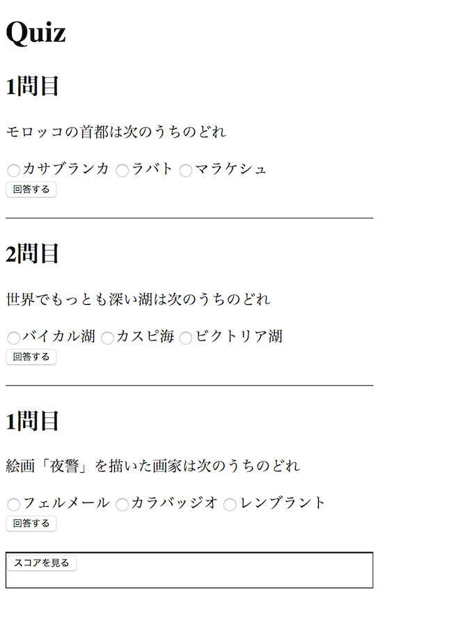

# チャレンジ6

```
所要時間: 30分
ステータス:
タイプ:
```

## 目的

- if文とswitch文を使ったプログラミングができるようになる
- 制御文を使って異なる結果を表示する簡易アプリケーションを作れるようになる。


## チャレンジの取り組み方

1. マイルストーンごとに要件に合うようにファイルを編集していきます。
2. 分からない部分があれば、テキストを復習して、再度チャレンジしてみましょう。
3. 再チャレンジしてしばらく考えても分からない場合はチャットでメンターに質問しましょう。
4. 完成したら、Dropboxでメンターとファイルを共有して下さい。
5. メンターから課題レビューが届きます。
6. ビデオチャットの際は、分からない点を更に突っ込んで聞いたり、より良い書き方を聞いてみましょう。

## 概要
if文とswitch文を使った簡単なクイズアプリを作ります。
クイズが終わったあとで正答率によって異なるメッセージを表示してみましょう。

### アプリケーション画面


## スターターファイル

自分のパソコン上に、challenge6というフォルダを作って、その中に`index.html`、 `styles.css` 、 `script.js` というファイルをそれぞれ作成しましょう。それぞれのファイルは以下のリンクよりコピーするかダウンロードしてください。

[codegrit-js-unit01-ch06-starter](https://github.com/codegrit-jp-students/codegrit-js-unit01-ch06-starter)


## マイルストーン１

### 要件
3つの選択肢があるクイズに3問挑戦して、最後にスコアを表示する簡易クイズアプリを作りましょう。
処理は`script.js`の中に書いていきます。

- 回答ボタンを押して回答した値がJavaScriptに渡される処理の流れを確認しましょう。
  1. 回答ボタンのクリックをトリガーとしてイベント発生させるのは、`<button>`タグの`onclick`属性で実現できます。
  
  ```html
      <button class="btn" type="button" onclick="answerQuiz();">回答する</button>
  ```
  
  スターターファイルではこの値、例えば1問目であれば`answerQuiz1();`のようにしています。これでJavaScript側の関数`answerQuiz1()`が呼ばれることになります。渡された値をどう処理するかはこの関数のブロック内に記述することで実現できます。

  ```js
  function answerQuiz1(){
      //ここに処理を書く
  }
  ```

  2.  ラジオボタンは`<form>`で囲まれた`<input>タグ`で作ることができます。スターターファイルでは、`<input>`タグの`name`属性の値に`answer`を設定し、また`value`属性には選択された回答の識別子としてa、b、cのいずれかを設定しています。

  ```html
  <input name="answer" type="radio" value="a">カサブランカ</input>
  ```

  `<form>`タグで囲まれた3つの`<input>`の中でどれが押されたかを知る最善の方法は、まず次の例のようにIDをキーにして`<form>`タグの要素を格納した変数を作成することです。
  ```js
  const quiz_1 = document.getElementById('quiz-1');
  ```
  ラジオボタンから回答を選択すると、この変数`quiz_1 `のvalueプロパティの値には、選択された`<input>`タグのvalue属性の値(文字列"a","b","c"のいずれか)が格納されています。この値は次のように`<input>`タグのname属性の値を使って取り出すことができます。
  ```js
  quiz_1.answer.value
  ```

- switch文を使って各問題の回答ボタンを押した後の処理を分岐させましょう。
  - 正解が選択されている場合に回答数をカウントする処理を書きましょう。そのために回答数をカウントする変数を作りましょう。変数名は任意ですが`score`など意味が推測できる名前が良いでしょう。この変数は全ての問題で共有して使われる必要があります。このようなどこからでもアクセスできる変数を取り扱う際は、変数の宣言を関数の外側に記述しておく必要があります。レッスン8で詳しく学びますがこのような変数を`グローバル変数`と言います。
  ```js
  let score = 0;// <- グローバル変数
  function answerQuiz1(){
  }
  ```
  switch文の処理の適切な場所に`console.log`を追加して、実行結果を確認できるようにして見ましょう。例として次のようなログが表示され確認ができると便利そうです。
  ```js
  //選択したボタンの判定
  console.log('1問目の' + quiz_1.answer.value + 'を選択しました');
  //回答結果
  console.log('正解です');
  //現在のスコアを表示
  console.log('現在のトータルスコア：' + score);
  ```


- 「スコアを見る」ボタンを押すと`id=score-message`の`<p>`タグ要素内にスコアが表示される機能を実装しましょう。処理は以下の関数`showScore`の中に書くことで実装できます。
  ```js
  function showScore(){
      //スコア
  }
  ```
  要素の中にデータを出力する処理は以下の`innerHTML`を使って実装できます。
  ```js
  document.getElementById('score-message').innerHTML= score;
  ```
  また同時に点数によって、例えば以下のようなメッセージを変化させる機能を`if文`を使って実装しましょう。
    - 3点：すばらしい！
    - 2点；おしい！
    - 1点；まあまあ
    - 0点；残念

## 評価

課題の後、以下の２つについてメンターにフィードバックをお願いします。

1. 要件のカバー度: 1.全く出来なかった 2.ほとんど出来なかった 3. 半分ほどは出来た 4.8割ほどは出来た 5. 全部出来た
2. 難易度: 1. とても難しかった 2. 難しかった 3. ちょうど良かった 4. 簡単だった 5. とても簡単だった
