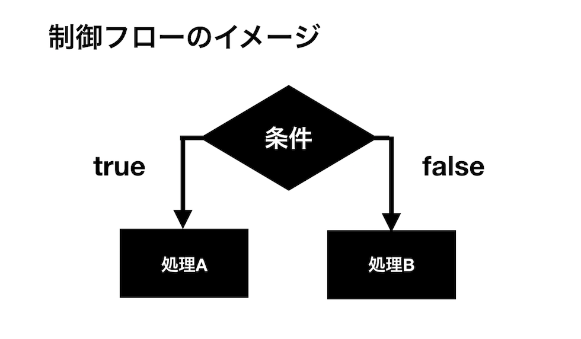

## 制御文

プログラミングの世界では条件により、その後の処理の内容を変化させていく方法が頻繁に行われます。条件によって処理の内容を分岐させていくことを**条件分岐**と言います。JavaScriptが使われるウェブサイトの場合でも時刻によって表示させる内容を変えたり、ブラウザのバージョンによってURLの値を変更したり、その他にも様々な場面で条件分岐は使われます。

このレッスンで学習する**_if文_**や**_switch文_**といった**_制御文_**と呼ばれる文は、そういった条件分岐処理を制御するのに使われます。制御文を使って処理を分岐させていくことでより複雑なプログラムを組むことができるようになります。

## 制御フロー

プログラミングでは条件分岐を行う際は、**_条件式_**と呼ばれる式を判断します。条件式はその中に記述された条件が真であれば`true`、偽であれば`false`を返します。この`true`か`false`のどちらを返すのかによってその次に続く処理を分岐させます。この条件分岐の構造を示すものを**_制御フロー(control structure)_**と呼びます。



プログラミンングをしていると、時として条件分岐が複数に枝分かれしてそのプロセスの流れが非常に複雑になることがあります。簡単な条件分岐であれば特に問題ないのですが、複雑な条件分岐の場合、その処理のプロセスを明確に把握しておくことはコードを設計する上でとても重要です。


## 条件式

ここでは先ほど述べた**_条件式_**について説明します。まず以前学習した論理型(Boolean)について簡単に確認しておきます。論理型というのは**真**と**偽**の2つの値しか持たない型のことです。JavaScriptでは真の場合を'true'、偽の場合を'false'という値(論理値)で表します。これらはあくまで論理型の値であって文字列ではないことに注意してください。

さて、プログラムが条件分岐を行う際にどうやって判断を行なっているかというと、すでに述べたように**_条件式_**というものを評価して真偽の判断を行います。もし条件式が真であればその式は`true`となり、そうでなければ`false`となります。  

簡単な条件式の例として`2 > 1`という式を考えてみます。「>」はすでに学んだように比較演算子と呼ばれるものです。左右の値の大小を比較し、その計算式が成り立つ場合には`true`、そうでない場合にはfalseを返します。`2 > 1`は常に成り立つのでこの条件式は常に`true`を返します。

以下は制御文の一つである**_if文_**を使った条件分岐の例です。

```js
if (2 > 1) {
  console.log(typeof (2 > 1)); // boolean
}
```

if文は`if(条件式){処理文}`という構文を持っていて、条件式が真の場合にのみブロック「{}」で囲んだ中の処理を実行します。今回の例では条件式は真となるので中の処理を実行してくれることになります。
また**_typeof演算子_**を使って条件式を確認して、確かにこれが論理型であることがわかります。


## 条件式に使う演算子

先ほど条件式で値の大小つを評価するために「>」の不等号演算子を使いました。条件式の真偽を評価するための演算子は、すでにレッスン3で学習した**_比較演算子_**、**_論理演算子_**を使います。
ここでもう一度レッスン3の比較演算子の項目を読んで、制御フローとリンクさせて理解しておくと良いでしょう。

簡単に復習として、`true`および`false`の論理型の値はそのまま、真および偽として条件式に使うことができる実例を見ておきましょう。

```js
if (true) {
  console.log('真'); // 実行される
}
```

## 比較、論理演算子の優先順位

レッスン3で学んだ**_比較演算子_**、**_論理演算子_**を使って条件式を評価する上で注意しておきたいこととして、これらの演算子を組み合わせて使う際には、それぞれの演算の順番の優先度を意識しておく必要があるというのがあります。具体的には、論理反転演算子`!`、`<、>、<=、>=`の関係演算子、`==,===,!=,!==`の等価演算子、論理AND`&&`、論理OR`||`の順番で優先度が下がって行きます。
```js
if (name === 'Yamada' && !url) {
  console.log('YamadaさんのURLは存在しません');
}
```
上の例では論理AND`&&`が最も優先度が低くなるため、条件式は
「変数nameが文字列'Yamada'に厳密に等しく」かつ「変数urlが`true`でなければ」処理を実行すると解釈できます。
