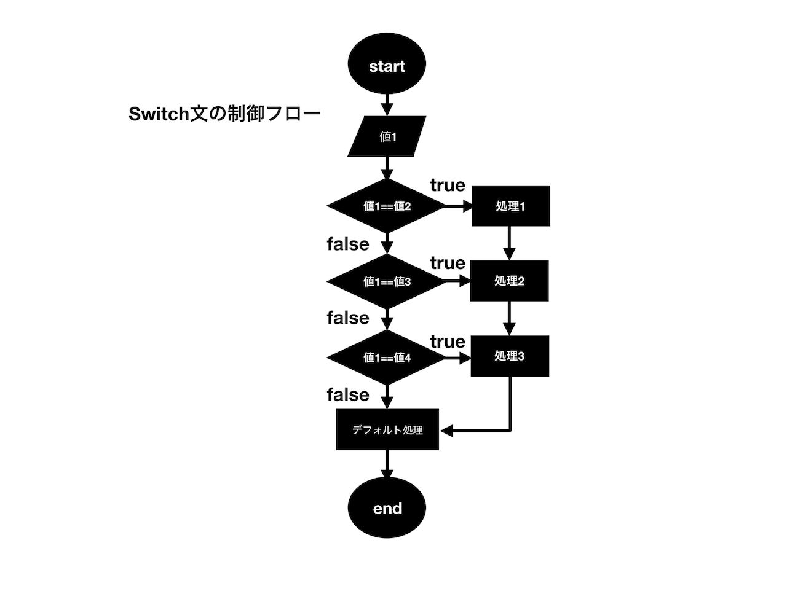

## switch文

**_if文_**以外の制御文として**_switch文_**を紹介します。**_switch文_**はまず基準となる変数(あるいは式)の中の値を評価します。次にその**_swich文_**のブロック内にその値と一致する**case 値:**を探しに行き、もし一致する値がある場合、そのcase以降の文が実行されます。命令文が実行されるとブロックを抜けます。**_switch文_**で書ける内容は**_if文_**で記述することも可能なので必須ではありませんが、**_if文_**に比べて処理が高速であり、また可読性が良いという特徴があります。



### swich文の構文

`switch文`の基本構文は次のようになります。

```js
switch (変数(式)) {
  case 値1:
    文;
    break;
  case 値2:
    文;
    break;
  case 値3:
    文;
    break;
}
```
具体的なサンプルコードをみてみましょう。

```js
let weather = 'sunny';
switch (weather) {
  case 'sunny':
    console.log('晴れです');
    break;
  case 'cloudy':
    console.log('曇りです');
    break;
  case 'rainy':
    console.log('雨です');
    break;
}
```

出力結果
```js
"晴れです"
```

<iframe width="100%" height="300" src="//jsfiddle.net/codegrit_hiro/gdwb3cup/3/embedded/js,html,css,result/dark/" allowfullscreen="allowfullscreen" allowpaymentrequest frameborder="0"></iframe>

このように変数と一致する値があれば、そのcaseに記述された処理が実行されます。
各`case`に続く文章の末尾に`break`が記述されていることに注目してください。**_switch文_**ではこの`break`を記述しておかないとそれ以降のcase内の文も実行してしまいます。

```js
//breakのないswitch文
let color = 'blue';
switch (color) {
  case 'blue':
    console.log('青です');
  case 'red':
    console.log('赤です');
  case 'yellow':
    console.log('黄色です');
}
```

出力結果：
```js
// コンソールの出力結果
"青です"
"赤です"
"黄色です"
```

<iframe width="100%" height="300" src="//jsfiddle.net/codegrit_hiro/gdwb3cup/4/embedded/js,html,css,result/dark/" allowfullscreen="allowfullscreen" allowpaymentrequest frameborder="0"></iframe>

上記の構文ではどの値も評価元の値と一致しない場合は、何も実行されずswitchのブロックを抜けます。もし**_if文_**の`else`の場合のように何も該当しない場合の処理を記載する場合は次のように`default`を記述しておきます。

```js
switch (式) {
  case 値1:
    文;
    break;
  case 値2:
    文;
    break;
  default: // 該当しない場合に実行される
    文;
}
```

以下の**_switch文_**を使ったサンプルコードでは、用意した変数の値と一致するものがないので最後の`default`の処理が実行されています。

```js
//defaultのあるswitch文のサンプルコード
let color = 'green';

switch (color) {
  case 'blue':
    console.log('青です');
    break;
  case 'red':
    console.log('赤です');
    break;
  case 'yellow':
    console.log('黄色です');
    break;
  default:
    console.log('該当する色がありません');
}
```

出力結果:
```js
//コンソールの出力結果
"該当する色がありません"
```

<iframe width="100%" height="300" src="//jsfiddle.net/codegrit_hiro/udybgakz/5/embedded/js,html,css,result/dark/" allowfullscreen="allowfullscreen" allowpaymentrequest frameborder="0"></iframe>

### 連続したcaseがある場合のswich文

先ほども述べたように**_switch文_**は`break`をつけない場合は、それ以降のcase内の文も実行します。この仕組みを使って複数の値に対して一つの結果を返す**_swicth文_**を書くことができます。下記の例では、例えば最初の3つの`case`でラベル付された値に該当した場合、どの場合も同じ処理文が実行されます。
```js
let bestAnimal = "Lion";
let species;

switch (bestAnimal) {
  case 'Cat':
  case 'Lion':
  case 'Fox':
    species = 'Mammal'; // 'Cat'、'Lion'、'Fox'の場合
    break;
  case 'Duck':
    species = "Bird";
    break;
  default:
    species = 'Nothing';
}

console.log(species); // "Mammal"
```

<iframe width="100%" height="300" src="//jsfiddle.net/codegrit_hiro/dunw7a1q/1/embedded/js,html,css,result/dark/" allowfullscreen="allowfullscreen" allowpaymentrequest frameborder="0"></iframe>

## 更に学ぼう

### 動画で学ぶ

- [JavaScript入門 - ドットインストール](https://dotinstall.com/lessons/basic_javascript_v2)

### 本で学ぶ

- [Eloquent JavaScript 3rd Edition](http://eloquentjavascript.net/)
